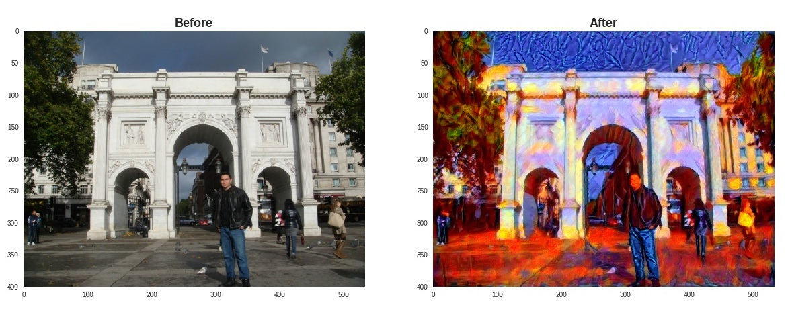

# Style Transfer
Transfer the style of an image to another image using Convolutional Neural Networks (CNNs) with PyTorch.

The model a pre-trained Net, the VGG19 Network, to extract the features of the content and style images to come up with a new design image. The style transfer method was created by leon A Gatys in this paper https://www.cv-foundation.org/openaccess/content_cvpr_2016/papers/Gatys_Image_Style_Transfer_CVPR_2016_paper.pdf

The below image shows on the left the content or target image and on the right the style image that is going to be transfered to the target image.

The below image show the before and after results of the style transfer.

